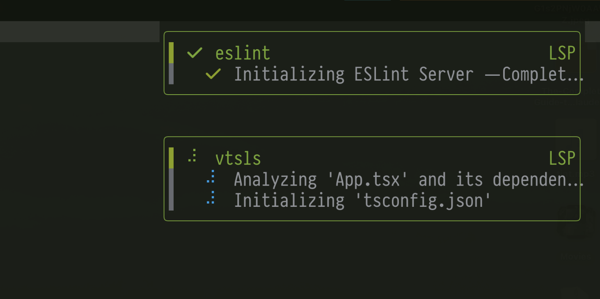

# lsp-progress-notify.nvim

[](https://github.com/nicholasxjy/lsp-progress-notify.nvim/actions/workflows/ci.yml)
[](https://github.com/nicholasxjy/lsp-progress-notify.nvim/actions/workflows/stylua.yml)
[](./LICENSE)
[](https://neovim.io/)

A Neovim plugin that displays LSP client loading, indexing, and initialization progress in compact floating windows.

It uses Neovim 0.11+'s `LspProgress` autocmd and updates the same notification across the `begin` / `report` / `end` lifecycle, instead of spamming a new popup for every progress event.

## Demo



## Features

- Display LSP progress with native Neovim floating windows
- Reuse a single notification for the same task
- Support concurrent progress from multiple LSP clients
- Animated spinner support
- Automatically finalize notifications when a client detaches
- Neovim 0.11+ only
- Implemented on top of the `LspProgress` autocmd

## Requirements

- **Neovim 0.11 or later**
- No external notification plugin is required

> This plugin does **not** support Neovim 0.10 or earlier.

## Installation

Make sure you are using Neovim `0.11+`, otherwise the plugin will not work.

This repository includes:

- `plugin/lsp-progress-notify.lua`: registers user commands
- `doc/lsp-progress-notify.txt`: `:help lsp-progress-notify`
- `lsp-progress-notify.nvim-scm-1.rockspec`: development rockspec
- `lsp-progress-notify.nvim-0.0.3-1.rockspec`: release rockspec for `luarocks` / `rocks.nvim`

### lazy.nvim

```lua
{
  "nicholasxjy/lsp-progress-notify.nvim",
  config = function()
    require("lsp-progress-notify").setup()
  end,
}
```

### vim.pack

```lua
vim.pack.add({
  "https://github.com/nicholasxjy/lsp-progress-notify.nvim",
})

require("lsp-progress-notify").setup()
```

After adding new plugins with `vim.pack`, restart Neovim. If needed, run:

```vim
:lua vim.pack.update()
```

### rocks.nvim / luarocks

If you use `rocks.nvim` or `luarocks`, the repository also ships a rockspec:

```lua
{
  "nicholasxjy/lsp-progress-notify.nvim",
  rocks = { "lsp-progress-notify.nvim" },
}
```

## Default configuration

```lua
require("lsp-progress-notify").setup({
  enabled = true,
  spinner_interval = 120,
  icons = {
    spinner = { "⠋", "⠙", "⠹", "⠸", "⠼", "⠴", "⠦", "⠧", "⠇", "⠏" },
    done = "",
  },
  messages = {
    complete = "Completed",
    detached = "Detached",
    working = "Working…",
  },
  notification = {
    ongoing_timeout = false,
    done_timeout = 2000,
    min_width = 32,
    width = 44,
    max_width = 56,
    max_height = 12,
    row = 1,
    col = 2,
    spacing = 1,
    border = "rounded",
    zindex = 50,
    winblend = 0,
    on_open = nil,
    on_close = nil,
  },
  title = function(client_name, task)
    return client_name
  end,
  format = function(client_name, task)
    local parts = {}

    if task.title and task.title ~= "" then
      table.insert(parts, task.title)
    end

    if task.message and task.message ~= "" and task.message ~= task.title then
      table.insert(parts, task.message)
    end

    local text = table.concat(parts, " — ")

    if text == "" then
      return task.done and "Completed" or "Working…"
    end

    return text
  end,
})
```

## Customization examples

### 1. More compact title

```lua
require("lsp-progress-notify").setup({
  title = function(client_name)
    return string.format(" %s", client_name)
  end,
})
```

### 2. Hide completed notifications faster

```lua
require("lsp-progress-notify").setup({
  notification = {
    done_timeout = 800,
  },
})
```

### 3. Run hooks when notifications open/close

```lua
require("lsp-progress-notify").setup({
  notification = {
    on_open = function(win)
      vim.wo[win].conceallevel = 0
    end,
    on_close = function()
      vim.schedule(function()
        print("LSP progress closed")
      end)
    end,
  },
})
```

### 4. Custom message format

```lua
require("lsp-progress-notify").setup({
  format = function(client_name, task)
    local label = task.title or task.message or "LSP"
    return string.format("[%s] %s", client_name, label)
  end,
})
```

## Commands

After startup, the plugin registers these commands:

- `:LspProgressNotifyEnable`
- `:LspProgressNotifyDisable`
- `:LspProgressNotifyToggle`

## Help

After installation, you can run:

```vim
:helptags ALL
:help lsp-progress-notify
```

## Health check

The plugin provides a health check:

```vim
:checkhealth lsp-progress-notify
```

It checks:

- whether your Neovim version is `0.11+`
- whether the built-in floating window backend is available
- whether the user commands were registered

## Exported API

```lua
local progress = require("lsp-progress-notify")

progress.setup(opts)
progress.enable()
progress.disable()
progress.is_enabled()
progress.status()
```

`status()` returns a snapshot of the currently tracked tasks, which is useful for debugging.

## Version compatibility

- Supported: Neovim `>= 0.11`
- Not supported: Neovim `0.10.x`, `0.9.x`, and earlier

This plugin no longer includes the legacy `$/progress` handler fallback, and uses the `LspProgress` autocmd exclusively.

## How it works

The plugin tracks each LSP client's progress token:

- `begin`: create or update a floating progress window
- `report`: update the existing window content
- `end`: switch the spinner to the done icon, then close after `done_timeout`

So language servers such as `lua_ls`, `rust_analyzer`, `tsserver`, and `gopls` that report work progress can show their loading state directly.

## Development

The repository includes:

- `tests/smoke.lua`: headless smoke test
- `.github/workflows/ci.yml`: GitHub Actions smoke test
- `.github/workflows/stylua.yml`: formatting check
- `.stylua.toml`: StyLua configuration
- `.luarc.json`: LuaLS configuration
- `CONTRIBUTING.md`: development notes

Local test:

```bash
nvim --headless -u NONE -c "lua dofile('tests/smoke.lua')" -c qa
```

Local formatting check:

```bash
stylua --check .
```

## License

MIT
